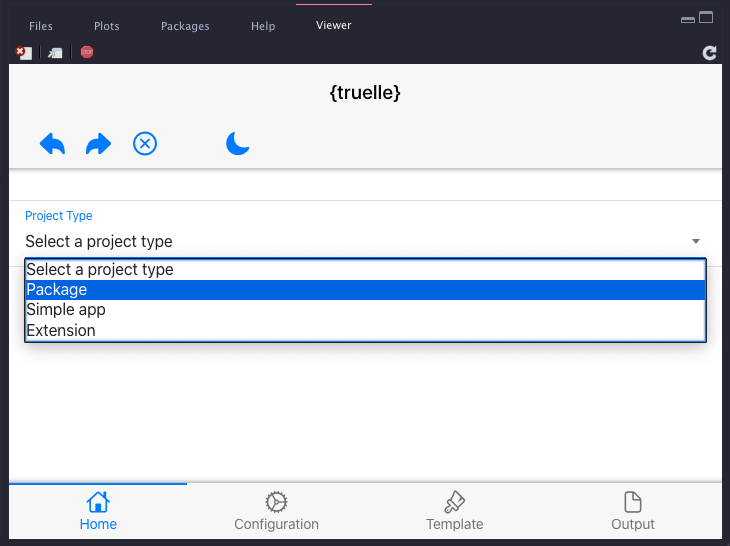
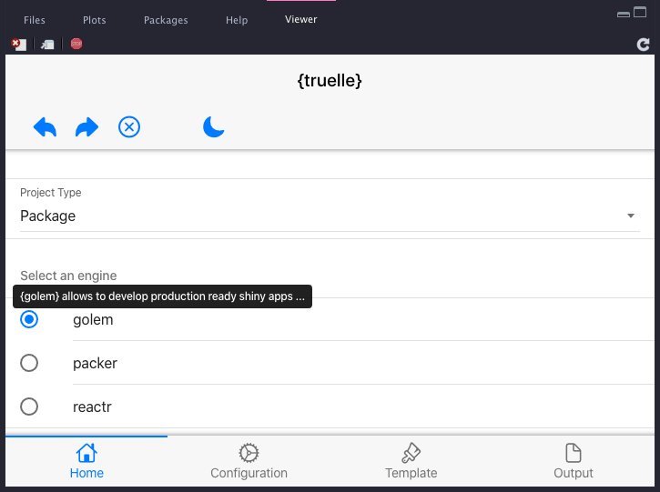
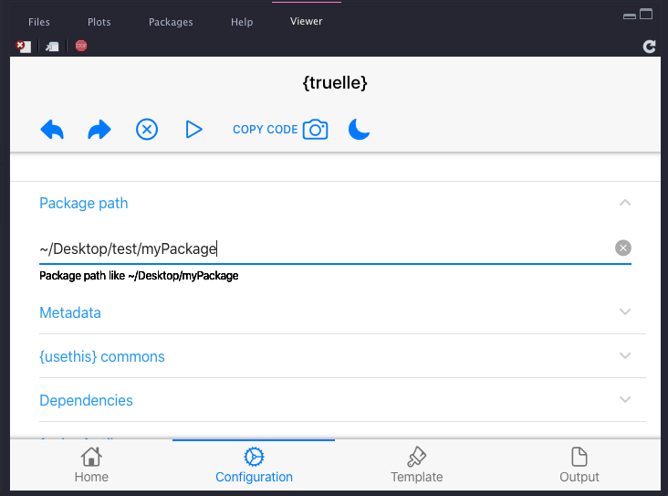
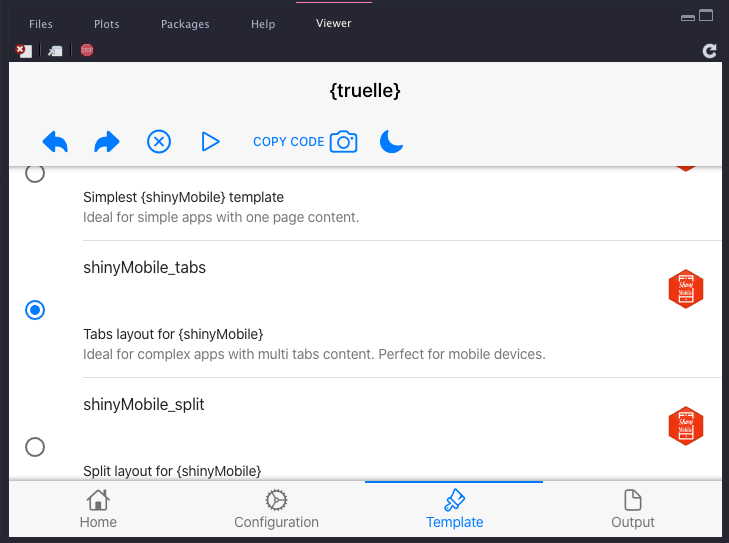
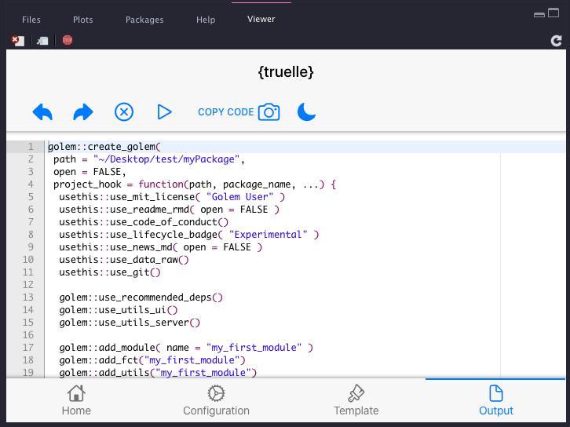
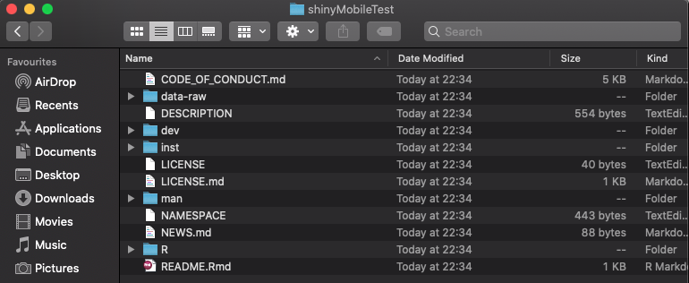

<!-- README.md is generated from README.Rmd. Please edit that file -->

```{r, include = FALSE}
knitr::opts_chunk$set(
  collapse = TRUE,
  comment = "#>",
  #fig.path = "man/figures/README-",
  out.width = "100%"
)
```

# truelle

<!-- badges: start -->
[](https://lifecycle.r-lib.org/articles/stages.html#experimental)
[](https://github.com/RinteRface/truelle/actions)
<!-- badges: end -->

The goal of `{truelle}` is to provide a GUI to the `{golem}` package and many more. 

## Installation

You can install the released version of truelle from [CRAN](https://CRAN.R-project.org) with:

``` r
remotes::install_github("RinteRface/truelle")
```

## Workflow example

This is a basic example which shows you how to start the `{truelle}` GUI:

```{r, eval=FALSE, example}
library(truelle)
run_app()
```

### Step 1: project type

Select __Package__ and choose the `{golem}` engine.

```{r, echo = FALSE, fig.show="hold", out.width="50%"}


```

### Step 2: options

Provide a valid package path and review project options.

```{r, echo = FALSE, out.width='50%', fig.align='center'}

```


### Step 3: UI layout

Select the Shiny layout of your choice. 

```{r, echo = FALSE, out.width='50%', fig.align='center'}

```


### Step 4: code output

Click on the `r emo::ji("play")` button or copy/paste `r emo::ji("photo")` the code to your terminal...

```{r, echo = FALSE, fig.show="hold", out.width="50%"}


```


### Step 5: develop

- Open the new project.
- Run `devtools::load_all()`.
- Enjoy ...
